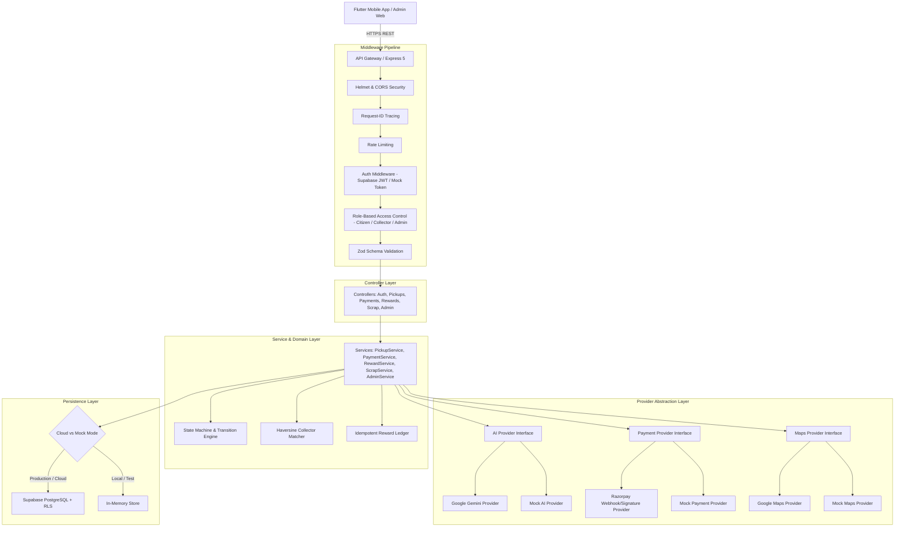

# System Architecture & Technical Design

This document details the architectural design, security model, state machines, and provider abstraction patterns powering the E-Kabadi backend.

---

## 1. Architectural Overview

The backend uses a clean, layered architectural pattern built on Node.js, TypeScript, and Express 5, integrating with Supabase PostgreSQL as its persistent datastore.



---

## 2. Core Design Principles

### 2.1 Separation of Concerns & Single Responsibility
- **Controllers** handle HTTP parameters, invoke domain services, and return uniform `ApiResponse` structures. They contain zero database logic.
- **Services** encapsulate all domain rules, state transitions, validation checks, and ledger operations.
- **Providers** encapsulate external third-party SDKs (Razorpay, Gemini, Google Maps) behind clean TypeScript interfaces.

### 2.2 Security & Least Privilege (Supabase RLS)
- The backend isolates privileged administrative tasks from normal user requests.
- Regular user interactions utilize user-scoped queries or Row Level Security (RLS) enforcement.
- Privileged operations (e.g. system seed, admin overrides, payment verification webhooks) use `supabaseAdmin` exclusively on the server side.
- Service-role credentials are never leaked to client applications.

### 2.3 Zero-Credential Development & Test Isolation
To guarantee instant onboarding and reliable CI/CD test execution without external cloud dependencies:
- When `SUPABASE_URL` is set to the default mock URL or `NODE_ENV === 'test'`, all services seamlessly route persistence to `src/db/in-memory-store.ts`.
- Mock providers (`MockAiProvider`, `MockPaymentProvider`, `MockMapsProvider`) allow complete end-to-end workflows (image analysis, payments, route calculations) to run 100% offline.

---

## 3. Pickup Request State Machine

State transitions for scrap pickups are strictly controlled. Transitions are guarded on two layers:
1. **Application Layer (`pickup.service.ts`)**: Throws `INVALID_STATUS_TRANSITION` (HTTP 400) if an illegal transition is attempted.
2. **Database Layer (`trg_validate_pickup_transition`)**: A PostgreSQL function and trigger reject illegal transitions even if invoked via direct SQL or external clients.

### Transition Graph

| Current State | Permitted Next States | Authorized Actors | Required Conditions |
|---|---|---|---|
| `pending` | `matching`, `cancelled` | System, Citizen | Pickup request registered |
| `matching` | `accepted`, `cancelled` | Collector, System, Citizen | Collector matched within radius |
| `accepted` | `onTheWay`, `cancelled` | Collector, Citizen | Collector confirms assignment |
| `onTheWay` | `arrived`, `cancelled` | Collector | Collector en route |
| `arrived` | `verified`, `cancelled` | Collector | Doorstep arrival confirmed |
| `verified` | `completed`, `cancelled` | Citizen, System | OTP confirmed + Actual weight recorded |
| `completed` | *Terminal state* | - | Payment confirmed & rewards credited |
| `cancelled` | *Terminal state* | - | Cancellation reason logged |

---

## 4. Provider Abstraction Architecture

### 4.1 AI Provider Interface (`src/integrations/ai/`)
```typescript
export interface IAiService {
  analyzeScrapImage(imageBase64: string, fileName?: string): Promise<ScrapAiAnalysisResult>;
}
```
- **`GeminiProvider`**: Integrates `@google/genai` using structured JSON output prompts with category, subcategory, estimated weight, confidence score, and recyclability tips.
- **`MockAiProvider`**: Evaluates mock image payloads or returns a realistic 94% confidence classification for PET Bottles or Mixed Scrap.

### 4.2 Payment Provider Interface (`src/integrations/payment/`)
```typescript
export interface IPaymentService {
  createOrder(pickupId: string, amount: number, currency?: string): Promise<PaymentOrderResult>;
  verifyPayment(paymentId: string, orderId: string, signature: string): Promise<PaymentVerificationResult>;
}
```
- **`RazorpayProvider`**: Uses HMAC SHA256 cryptographic verification of `razorpay_signature`.
- **`MockPaymentProvider`**: Simulates order creation and verification for rapid development and testing.

---

## 5. Rewards Ledger & Idempotency

- **Citizen Rule**: Earns 10% Eco Points ($\lfloor \text{amount} \times 0.10 \rfloor$) **only** when the final bill is $\ge ₹500$.
- **Collector Rule**: Earns 10% Eco Coins on every completed pickup without any minimum threshold.
- **Idempotency**: All reward transactions are keyed by a unique reference string (`pickup_<pickupId>`). Re-triggering a payment or completion will not duplicate points or coins.
