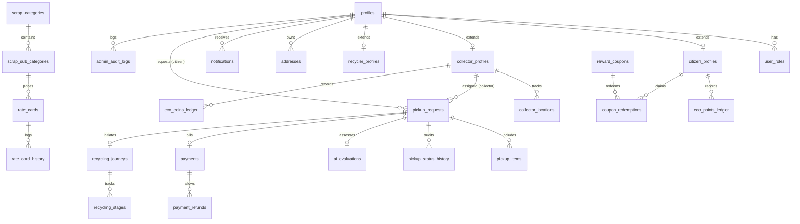

# Database Architecture & Schema Specification

This document details the PostgreSQL schema designed for Supabase, comprising 26 normalized tables, custom enums, check constraints, foreign keys, indexes, Row Level Security (RLS) policies, and database triggers.

---

## 1. Schema Diagram & Entity Structure



---

## 2. Table Catalog (26 Tables)

### 2.1 Identity & User Profiles
1. **`profiles`**: Central profile table linked to `auth.users(id)`. Stores name, email, phone, avatar URL, verification status, and timestamps.
2. **`user_roles`**: Maps users to roles (`citizen`, `collector`, `admin`, `recycler`). Allows role-based querying with unique `(user_id, role)`.
3. **`citizen_profiles`**: Citizen-specific data: `eco_points_balance`, `total_scrap_sold_kg`, `total_earnings_inr`, and default address reference.
4. **`collector_profiles`**: Collector-specific data: vehicle number, vehicle type, license number, `eco_coins_balance`, `current_status` (`Active`, `Offline`, `On Break`), average rating, and total pickups.
5. **`recycler_profiles`**: Industrial recycler facility records: facility name, registration number, processing capacity (kg/day), operating address.
6. **`addresses`**: User addresses with geolocation coordinates (`latitude`, `longitude`), street line, landmark, city, postal code, and default flag.
7. **`collector_locations`**: Real-time GPS location breadcrumbs of active collectors for geospatial proximity queries.

### 2.2 Scrap Catalog & Dynamic Rates
8. **`scrap_categories`**: Top-level categories (`Paper`, `Plastic`, `Metal`, `E-Waste`, `Glass`, etc.) with display icons and sort order.
9. **`scrap_sub_categories`**: Granular items (`PET Bottles`, `Cardboard`, `Copper Wire`, `Batteries`) linked to parent category.
10. **`rate_cards`**: Live market rate cards with `rate_per_kg`, price trend (`+2%`, `-1%`), and active toggle.
11. **`rate_card_history`**: Audit log of historical price modifications with timestamps and admin user attribution.

### 2.3 Pickup Requests & AI Analysis
12. **`pickup_requests`**: Core transaction table tracking citizen, assigned collector, status (`pending` through `completed`), scheduled date, slot, OTP code, final weight, and bill.
13. **`pickup_items`**: Line items inside a pickup with estimated weight, agreed rate per kg, and final measured weight.
14. **`pickup_status_history`**: Immutable status audit trail recording who transitioned the state and at what timestamp.
15. **`ai_evaluations`**: Records AI vision analysis output: detected category, confidence score, raw image URL, and suggestion tags.

### 2.4 Payments & Refunds
16. **`payments`**: Payment transactions with gateway reference (Razorpay order & payment ID), amount, currency (`INR`), payment method, and signature verification status.
17. **`payment_refunds`**: Disputed transaction refund logs with gateway refund IDs and resolution timestamps.

### 2.5 Rewards & Coupons Ledger
18. **`eco_points_ledger`**: Double-entry reward ledger for citizens. Tracks points earned (when bill $\ge ₹500$) or redeemed, with reference IDs.
19. **`eco_coins_ledger`**: Double-entry reward ledger for collectors. Tracks 10% coin credits for all completed pickups.
20. **`reward_coupons`**: Available marketplace coupons (e.g. `Swiggy 20% Off`, `Plant a Sapling`) with points cost and partner info.
21. **`coupon_redemptions`**: Record of citizen coupon redemptions with unique coupon codes and usage timestamps.

### 2.6 Circular Economy & Administration
22. **`recycling_journeys`**: End-to-end transparency record mapping a completed pickup to an industrial facility.
23. **`recycling_stages`**: Detailed milestone tracker (`collected`, `sorting`, `processing`, `recycled`) with timestamps and facility notes.
24. **`notifications`**: User push/in-app notifications with read/unread tracking.
25. **`admin_audit_logs`**: Privileged admin action trail recording target entities, action types, and metadata diffs.
26. **`environmental_impact`**: Aggregate carbon offset, trees saved, water conserved, and landfill diversion metrics.

---

## 3. Database State Transition Trigger

To enforce data integrity regardless of the access vector, the database includes a PostgreSQL trigger:

```sql
CREATE OR REPLACE FUNCTION fn_validate_pickup_transition()
RETURNS TRIGGER AS $$
BEGIN
  IF OLD.status = 'pending' AND NEW.status NOT IN ('matching', 'cancelled') THEN
    RAISE EXCEPTION 'Invalid transition from pending to %', NEW.status;
  ELSIF OLD.status = 'matching' AND NEW.status NOT IN ('accepted', 'cancelled') THEN
    RAISE EXCEPTION 'Invalid transition from matching to %', NEW.status;
  ELSIF OLD.status = 'accepted' AND NEW.status NOT IN ('onTheWay', 'cancelled') THEN
    RAISE EXCEPTION 'Invalid transition from accepted to %', NEW.status;
  ELSIF OLD.status = 'onTheWay' AND NEW.status NOT IN ('arrived', 'cancelled') THEN
    RAISE EXCEPTION 'Invalid transition from onTheWay to %', NEW.status;
  ELSIF OLD.status = 'arrived' AND NEW.status NOT IN ('verified', 'cancelled') THEN
    RAISE EXCEPTION 'Invalid transition from arrived to %', NEW.status;
  ELSIF OLD.status = 'verified' AND NEW.status NOT IN ('completed', 'cancelled') THEN
    RAISE EXCEPTION 'Invalid transition from verified to %', NEW.status;
  ELSIF OLD.status = 'completed' AND NEW.status != 'completed' THEN
    RAISE EXCEPTION 'Completed pickups cannot be modified';
  ELSIF OLD.status = 'cancelled' AND NEW.status != 'cancelled' THEN
    RAISE EXCEPTION 'Cancelled pickups cannot be modified';
  END IF;
  RETURN NEW;
END;
$$ LANGUAGE plpgsql;

CREATE TRIGGER trg_validate_pickup_transition
BEFORE UPDATE OF status ON pickup_requests
FOR EACH ROW
EXECUTE FUNCTION fn_validate_pickup_transition();
```

---

## 4. Row Level Security (RLS) Policy Design

All tables have RLS enabled (`ALTER TABLE ... ENABLE ROW LEVEL SECURITY;`).
1. **Citizens**: Can view and modify their own profile, addresses, pickup requests, payments, points ledger, and notifications.
2. **Collectors**: Can view their assigned pickups, update location coordinates, record OTP verification, and view coin earnings.
3. **Admin Service Role**: Server-side privileged operations utilize the service role key, bypassing RLS exclusively for validated backend services.
