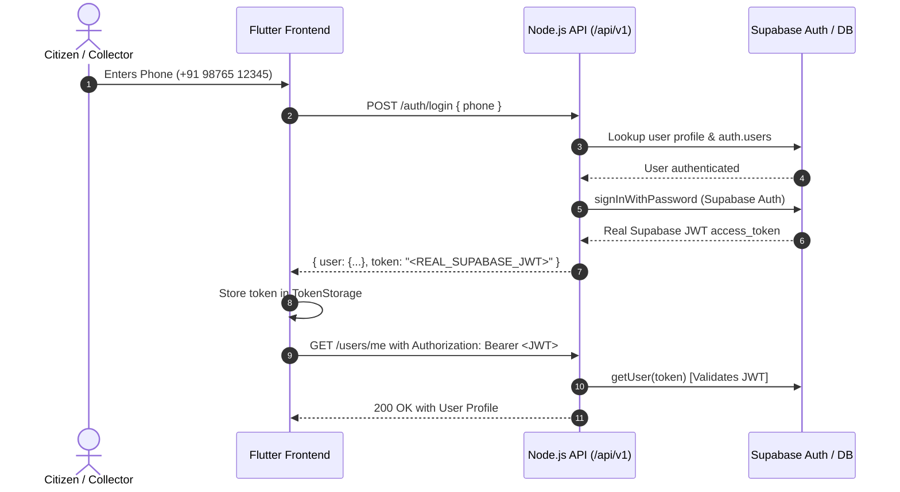

# E-Kabadi Flutter ↔ Backend Integration Guide

This guide documents the complete production integration between the Flutter frontend (`./frontend`) and the Node.js/TypeScript backend (`./backend`) verified against the live Supabase instance.

---

## 1. Flutter Setup & Dependencies

The Flutter frontend communicates with the Node.js backend using standard HTTP and Riverpod state management.

### Key Dependencies (`pubspec.yaml`):
```yaml
dependencies:
  flutter:
    sdk: flutter
  flutter_riverpod: ^2.5.1
  go_router: ^14.2.0
  google_fonts: ^6.2.1
  flutter_animate: ^4.5.0
  intl: ^0.19.0
  lucide_icons: ^0.257.0
  image_picker: ^1.1.2
  http: ^1.2.2
```

Run inside `./frontend`:
```bash
flutter pub get
```

---

## 2. Backend Startup

### Start Live Server:
```bash
cd backend
npm run build
npm start
```

### Start in Development / Hot-Reload Mode:
```bash
cd backend
npm run dev
```

The server starts on port `5000` with the base route `http://localhost:5000/api/v1`.

---

## 3. Environment Configuration

The backend connects to the live Supabase instance via `.env`:
```ini
PORT=5000
NODE_ENV=development
SUPABASE_URL=https://psvyucnqxavtrfkajaki.supabase.co
SUPABASE_ANON_KEY=eyJhbGciOi...
SUPABASE_SERVICE_ROLE_KEY=eyJhbGciOi...
LIVE_DB=true
```

> [!CAUTION]
> The `SUPABASE_SERVICE_ROLE_KEY` must NEVER be exposed, bundled, or sent to Flutter. Flutter interacts exclusively with the Node.js API using real user JWT access tokens.

---

## 4. Platform Base URLs

The Flutter API layer (`lib/core/config/api_config.dart`) dynamically resolves the backend URL based on the running host:

| Platform | URL | Note |
|---|---|---|
| **Android Emulator** | `http://10.0.2.2:5000/api/v1` | Automatically routed to host machine |
| **iOS Simulator** | `http://localhost:5000/api/v1` | Runs on macOS host loopback |
| **Flutter Web** | `http://localhost:5000/api/v1` | Runs directly in browser |
| **Physical Device (LAN)** | `http://<YOUR_LAN_IP>:5000/api/v1` | Set via `--dart-define=API_URL=http://<IP>:5000/api/v1` |
| **Production Cloud** | `https://api.e-kabadi.com/api/v1` | Set via `--dart-define=API_URL=...` |

---

## 5. Authentication Flow (Real Supabase JWT)



### Demo Accounts:
- **Citizen**: Phone `9876512345` (Aarav Sharma) • Default OTP: `4829`
- **Collector**: Phone `9876543210` (Ramesh Kumar) • Default OTP: `4829`

---

## 6. API Client Usage

The app uses a centralized `ApiClient` (`lib/core/network/api_client.dart`) that automatically injects the active Supabase JWT:

```dart
final client = ref.read(apiClientProvider);

// GET request (Bearer token attached automatically)
final rates = await client.get('/scrap/rates');

// POST request
final newPickup = await client.post('/pickups', body: {
  'items': [...],
  'scheduledDate': 'Today, 18 Sep',
  'timeSlot': '11 AM - 1 PM',
  'address': 'Sector 62, Noida',
});
```

---

## 7. Endpoint Mapping

| Feature | HTTP Method & Endpoint | Frontend Repository / Service |
|---|---|---|
| **Login with Mobile** | `POST /api/v1/auth/login` | `HttpAuthRepository.loginWithPhone` |
| **Verify OTP** | `POST /api/v1/auth/verify-otp` | `HttpAuthRepository.verifyOtp` |
| **Select Role** | `POST /api/v1/auth/role` | `HttpAuthRepository.selectRole` |
| **Fetch Current Profile** | `GET /api/v1/users/me` | `HttpAuthRepository.getCurrentUser` |
| **Scrap Rates & Categories** | `GET /api/v1/scrap/rates` | `HttpScrapRepository.getCategoryPrices` |
| **Popular Scrap Items** | `GET /api/v1/scrap/popular` | `HttpScrapRepository.getPopularItems` |
| **AI Scrap Vision Analysis** | `POST /api/v1/scrap/analyze` | `HttpAiService.analyzeScrapImage` |
| **Create Pickup Request** | `POST /api/v1/pickups` | `HttpPickupRepository.createPickupRequest` |
| **List User Pickups** | `GET /api/v1/pickups` | `HttpPickupRepository.getCitizenPickups` |
| **Advance Pickup Status** | `PATCH /api/v1/pickups/:id/status` | `HttpPickupRepository.updatePickupStatus` |
| **Doorstep Scale & OTP Verify** | `POST /api/v1/pickups/:id/verify` | `HttpPickupRepository.verifyAndCompletePickup` |
| **Create Payment Order** | `POST /api/v1/payments/create` | `HttpPaymentRepository.recordPayment` |
| **Verify Payment Signature** | `POST /api/v1/payments/verify` | `HttpPaymentRepository.recordPayment` |
| **Citizen Eco Points Ledger** | `GET /api/v1/rewards/points` | `HttpRewardsRepository.getCitizenPointHistory` |
| **Collector Eco Coins Ledger** | `GET /api/v1/rewards/coins` | `HttpRewardsRepository.getCollectorCoinHistory` |
| **Coupons Catalog** | `GET /api/v1/rewards/coupons` | `HttpRewardsRepository.getAvailableCoupons` |
| **Recycling Journey Trace** | `GET /api/v1/recycling/pickup/:id` | `HttpRewardsRepository.getRecyclingJourneys` |
| **Notifications** | `GET /api/v1/notifications` | `HttpNotificationService.getNotifications` |

---

## 8. Error Handling

Every API call unmarshals server errors via `ApiException`:
- **401 Unauthorized**: Token expired or missing → prompts re-login.
- **403 Forbidden**: Role violation (e.g. citizen trying to perform collector action).
- **404 Not Found**: Resource not found.
- **409 Conflict**: Invalid pickup state machine transition (e.g. attempting to jump backwards).
- **Network Failure**: Handled with `ApiException.networkError()`, showing user-friendly offline toast rather than freezing.

---

## 9. Mock vs Live Mode Toggle

The application preserves full mock fallbacks for offline development:
- **Default**: `ApiConfig.useMock = false` (LIVE Mode)
- **To enable Mock Mode at build time**:
  ```bash
  flutter run --dart-define=USE_MOCK=true
  ```
- **To enable Mock Mode at runtime**:
  ```dart
  ApiConfig.useMock = true;
  ```

---

## 10. Verification & Testing

### 1. Run Backend Offline Tests (25 tests):
```bash
cd backend
npm test
```

### 2. Run Backend Live Supabase Security Tests (18 tests):
```bash
cd backend
npm run test:live
```

### 3. Run Flutter App:
```bash
cd frontend
flutter run
```

---

## 11. Security Audit Results

A search of the entire Flutter codebase confirmed 0 occurrences of backend secrets:
- `SUPABASE_SERVICE_ROLE_KEY`: **0 occurrences**
- `service_role`: **0 occurrences**
- `JWT_SECRET`: **0 occurrences**
- `RAZORPAY_KEY_SECRET`: **0 occurrences**
- `GEMINI_API_KEY`: **0 occurrences**
- `GOOGLE_MAPS_API_KEY`: **0 occurrences**

---

## 12. Known Limitations & Next Steps

1. **Third-Party Payment Gateway**:
   - Razorpay integration is currently backed by `MockPaymentProvider` while awaiting commercial merchant credentials.
2. **Third-Party Gemini API Key**:
   - Scrap classification falls back gracefully to `MockAiProvider` when `GEMINI_API_KEY` is not provided in `.env`.
3. **Realtime Subscriptions**:
   - Currently, pickup status refreshes after user actions. Supabase Realtime WebSocket subscriptions can be added in a future phase.
