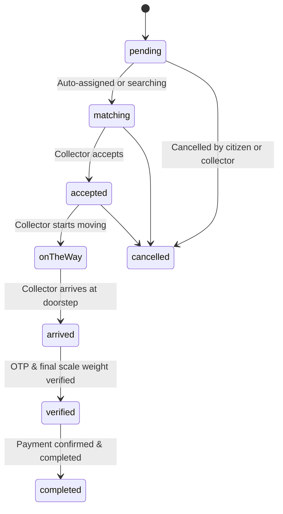

# Flutter Integration Guide for E-Kabadi

This guide explains how Flutter engineers can connect the existing frontend (`./frontend`) to the production-ready Node.js/TypeScript backend (`./backend`).

---

## 1. Network & Environment Setup

### 1.1 Base URL Configuration
Create or update an API configuration constant in Flutter:

```dart
// lib/config/api_config.dart
import 'dart:io';

class ApiConfig {
  // Use 10.0.2.2 for Android emulator, localhost for iOS simulator/Web, or production URL
  static String get baseUrl {
    if (Platform.isAndroid) {
      return 'http://10.0.2.2:5000/api/v1';
    } else {
      return 'http://localhost:5000/api/v1';
    }
  }

  static const String productionUrl = 'https://api.e-kabadi.com/api/v1';
}
```

### 1.2 Authentication Header
All authenticated requests must include the JWT token in the `Authorization` header:
```http
Authorization: Bearer <supabase_access_token_or_dev_token>
```
During development and testing, mock tokens are accepted:
- `mock-citizen-token` -> Authenticates as Aarav Sharma (`mock-citizen-001`, role: `citizen`)
- `mock-collector-token` -> Authenticates as Rajesh Kumar (`mock-collector-001`, role: `collector`)
- `mock-admin-token` -> Authenticates as System Admin (`mock-admin-001`, role: `admin`)

---

## 2. API Response Wrapper Contract

Every backend response follows a unified format:

### Success (HTTP 200 / 201)
```json
{
  "success": true,
  "data": { ... },
  "message": "Operation completed successfully",
  "requestId": "550e8400-e29b-41d4-a716-446655440000"
}
```

### Error (HTTP 400 / 401 / 403 / 404 / 409 / 500)
```json
{
  "success": false,
  "error": {
    "message": "Invalid status transition from 'verified' to 'pending'",
    "code": "INVALID_STATUS_TRANSITION"
  },
  "requestId": "550e8400-e29b-41d4-a716-446655440000"
}
```

---

## 3. Replacing Mock Services with Real API Calls

### 3.1 Authentication & Profile Service

#### Login
- **Endpoint**: `POST /auth/login`
- **Request Body**:
```json
{
  "email": "aarav.sharma@example.com",
  "password": "Password123!",
  "role": "citizen"
}
```
- **Response**:
```json
{
  "success": true,
  "data": {
    "token": "eyJhbGciOi...",
    "user": {
      "id": "mock-citizen-001",
      "name": "Aarav Sharma",
      "phone": "+91 98765 12345",
      "email": "aarav.sharma@example.com",
      "role": "citizen",
      "address": "Flat 402, Green Valley Apts, Sector 62, Noida, UP",
      "rating": 4.8,
      "isVerified": true,
      "ecoPoints": 840,
      "ecoCoins": 0,
      "profilePhoto": ""
    }
  }
}
```

#### Fetch Current User (`GET /users/me`)
```dart
Future<UserModel> fetchCurrentUser(String token) async {
  final res = await http.get(
    Uri.parse('${ApiConfig.baseUrl}/users/me'),
    headers: {'Authorization': 'Bearer $token'},
  );
  final json = jsonDecode(res.body);
  return UserModel.fromJson(json['data']);
}
```

---

### 3.2 AI Scrap Recognition & Rate Card

#### Scrap Rate Card
- **Endpoint**: `GET /scrap/rates`
- **Response**:
```json
{
  "success": true,
  "data": [
    {
      "id": "rate-1",
      "category": "Paper",
      "subCategory": "Newspaper",
      "ratePerKg": 14.0,
      "unit": "kg",
      "priceChange": "+2%",
      "iconName": "newspaper"
    },
    {
      "id": "rate-2",
      "category": "Plastic",
      "subCategory": "PET Bottles",
      "ratePerKg": 16.0,
      "unit": "kg",
      "priceChange": "+5%",
      "iconName": "water_bottle"
    }
  ]
}
```

#### AI Image Analysis
- **Endpoint**: `POST /scrap/analyze`
- **Request Body**:
```json
{
  "imageBase64": "data:image/jpeg;base64,/9j/4AAQSkZJRg...",
  "fileName": "scrap_pile.jpg"
}
```
- **Response**:
```json
{
  "success": true,
  "data": {
    "detectedCategory": "Plastic",
    "subCategory": "PET Bottles",
    "estimatedWeightKg": 3.5,
    "confidenceScore": 0.94,
    "ratePerKg": 16.0,
    "estimatedValue": 56.0,
    "recyclabilityTips": "Rinse clean and flatten bottles to save space."
  }
}
```

---

### 3.3 Pickup Lifecycle & State Machine



#### Create Pickup Request
- **Endpoint**: `POST /pickups`
- **Request Body**:
```json
{
  "pickupDate": "2026-09-23",
  "pickupTime": "10:00 AM - 12:00 PM",
  "address": "Flat 402, Green Valley Apts, Sector 62, Noida, UP",
  "notes": "Gate code is #1234",
  "items": [
    {
      "category": "Plastic",
      "subCategory": "PET Bottles",
      "estimatedWeight": 3.5,
      "ratePerKg": 16.0,
      "estimatedPrice": 56.0
    }
  ]
}
```
- **Response**:
```json
{
  "success": true,
  "data": {
    "id": "PK-8291",
    "citizenId": "mock-citizen-001",
    "collectorId": "col-001",
    "status": "matching",
    "otpCode": "4829",
    "items": [...],
    "pickupDate": "2026-09-23",
    "pickupTime": "10:00 AM - 12:00 PM"
  }
}
```

#### Advance Pickup Status (Collector)
- **Endpoint**: `PATCH /pickups/:id/status`
- **Request Body**:
```json
{ "status": "arrived" }
```

#### Verify Pickup with OTP & Actual Scale Weight (Doorstep Verification)
- **Endpoint**: `POST /pickups/:id/verify`
- **Request Body**:
```json
{
  "otpCode": "4829",
  "finalWeight": 4.2,
  "finalAmount": 126.0
}
```
- **Response**:
```json
{
  "success": true,
  "data": {
    "id": "PK-8291",
    "status": "verified",
    "finalWeight": 4.2,
    "finalAmount": 126.0
  }
}
```

---

### 3.4 Payments & Rewards Ledger

#### 1. Create Payment Order
- **Endpoint**: `POST /payments/create`
- **Request Body**:
```json
{ "pickupId": "PK-8291" }
```
- **Response**:
```json
{
  "success": true,
  "data": {
    "orderId": "order_mock_1727021400000",
    "amount": 126.0,
    "currency": "INR",
    "pickupId": "PK-8291",
    "key": "rzp_test_mock"
  }
}
```

#### 2. Verify Payment Order
- **Endpoint**: `POST /payments/verify`
- **Request Body**:
```json
{
  "paymentId": "pay_mock_1727021400000",
  "orderId": "order_mock_1727021400000",
  "signature": "mock_sig_1727021400000",
  "pickupId": "PK-8291"
}
```
- **Response**:
```json
{
  "success": true,
  "data": {
    "paymentId": "pay_mock_1727021400000",
    "orderId": "order_mock_1727021400000",
    "status": "paid",
    "pickupStatus": "completed",
    "rewardsAwarded": {
      "citizenPoints": 0,
      "collectorCoins": 12
    }
  }
}
```

> [!IMPORTANT]
> **Citizen ₹500 Threshold Rule**:
> As specified in Flutter's `RewardRules`, citizen Eco Points are awarded only when the final verified bill is ₹500 or higher (10% of bill).
> For bills under ₹500, `citizenPoints` is `0`.
> Collectors receive 10% Eco Coins on every completed transaction without any threshold!

---

### 3.5 Recycling Journey & Impact

#### Track Recycling Stages
- **Endpoint**: `GET /recycling/pickup/:pickupId`
- **Response**:
```json
{
  "success": true,
  "data": {
    "id": "RJ-9481",
    "pickupId": "PK-9481",
    "currentStage": "sorting",
    "facilityName": "Green Earth Processing Hub, Greater Noida",
    "stages": [
      {
        "stage": "collected",
        "title": "Doorstep Collection",
        "description": "Scrap picked up by verified collector Ramesh Kumar",
        "timestamp": "Today, 10:15 AM",
        "isCompleted": true
      },
      {
        "stage": "sorting",
        "title": "Facility Sorting",
        "description": "Scrap segregated by grade at Green Earth Processing Hub",
        "timestamp": "Today, 02:30 PM",
        "isCompleted": true
      },
      {
        "stage": "processing",
        "title": "Industrial Shredding",
        "description": "Cleaned and shredded into uniform PET flakes",
        "timestamp": "Tomorrow, Expected",
        "isCompleted": false
      },
      {
        "stage": "recycled",
        "title": "New Product Manufacturing",
        "description": "Extruded into recycled polyester fiber for eco-apparel",
        "timestamp": "Estimated 3 days",
        "isCompleted": false
      }
    ]
  }
}
```
